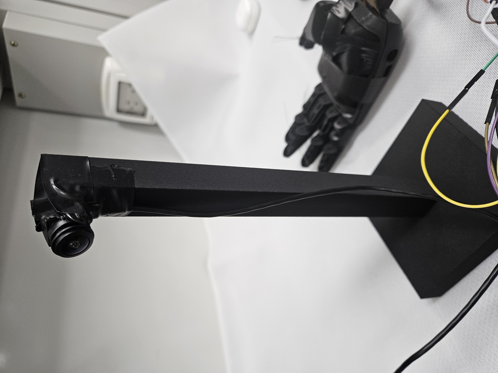
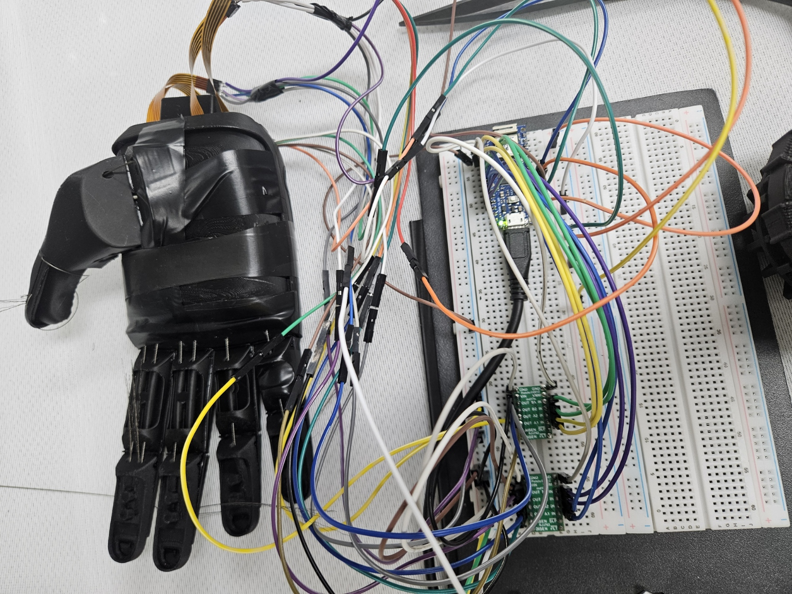
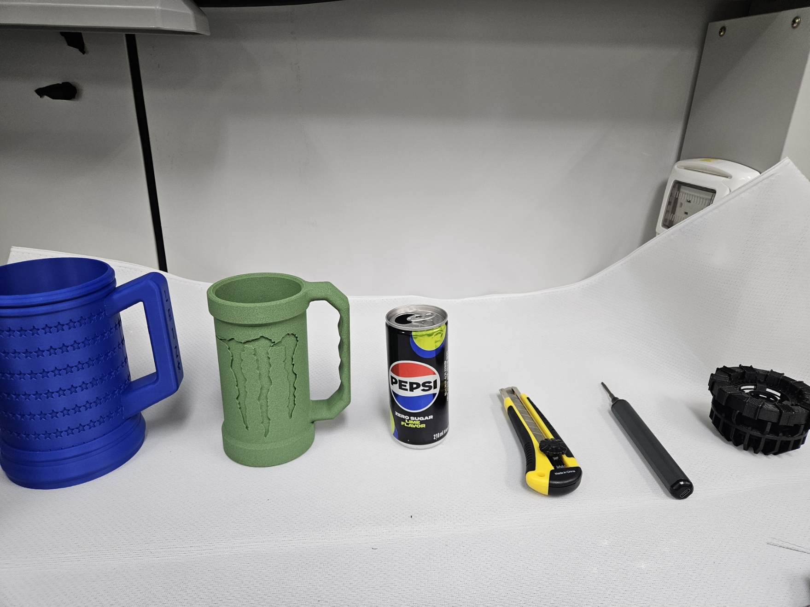

# 접근 방향과 물체 Affordance를 고려한 비전 기반 적응형 로봇손 파지 시스템

외부에 고정한 RGB 카메라 한 대로 물체에서 잡아도 되는 부위와 피해야 하는 부위를 나누고,
로봇손이 어느 방향에서 다가오는지에 따라 잡을 곳과 손 자세를 정해 실제로 구동한다.

새 분할 신경망을 제안하는 연구가 아니다. 공개 affordance 데이터 학습부터 반자동 라벨링,
실시간 추론, 후보 선택, 실제 손 구동까지를 하나의 동작하는 시스템으로 잇고 각 단계를
검증한 응용 연구다.

이 저장소는 **2026년 8월 28일 최종 발표 시점**의 상태다.

| | |
|---|---|
| 인식 | RF-DETR-Seg Nano (최종), YOLO11s-seg (비교 계보) |
| 클래스 | `handle_grasp_region`, `body_grasp_region`, `functional_region`, `robot_hand` |
| 자세 | `PRECISION` / `WRAP` / `POWER` |
| 하드웨어 | Brunel Hand V2.0 + PQ12-100-12-P ×4 + DRV8833 ×2 + Arduino Nano 33 IoT |
| 추론 | Jetson Orin Nano Super 온보드 8.4~8.7 FPS |



## 먼저 읽을 것

인수인계 문서는 셋이다. 순서대로 읽으면 30분 안에 첫 추론까지 간다.

1. **이 README** — 설치와 첫 실행, 반드시 알아야 할 함정
2. **[docs/EXPERIMENT_LINEAGE.md](docs/EXPERIMENT_LINEAGE.md)** — 실험 A~P 계보. 폐기한 시도와 그 이유
3. **[docs/NEXT_STEPS.md](docs/NEXT_STEPS.md)** — 이어서 할 일과 아직 검증되지 않은 부분

배경과 근거 전체는 [docs/FINAL_REPORT_20260824.md](docs/FINAL_REPORT_20260824.md)에 있다.
수치의 원본은 [docs/model_metrics_summary.md](docs/model_metrics_summary.md)다.

## 반드시 알아야 할 함정 셋

이 셋을 모르면 며칠을 잃는다. 실제로 잃었다.

### 1. conda 환경이 둘이다

YOLO 계보와 RF-DETR 계보가 다른 환경을 쓴다. 섞으면 `ModuleNotFoundError: No module named 'rfdetr'`가 난다.

| 환경 | 용도 | 핵심 패키지 |
|---|---|---|
| `hjh_vision_hand_train` | YOLO 계보 학습·평가, 데이터 변환 | ultralytics 8.3.163 |
| `hjh_rfdetr` | RF-DETR 계보 학습·평가·실시간 추론 | rfdetr |

### 2. 클래스 번호는 0부터 시작한다

`handle=0`, `body=1`, `functional=2`, `robot_hand=3`이다.

검출 결과에서 클래스 기준을 **프레임마다 다시 추정하면 안 된다.** 손잡이가 없는 프레임에서
최소 id가 1이 되어 모든 클래스가 한 칸씩 밀린다. `body`가 `handle`로, `robot_hand`가
`functional`로 보인다.

이 버그가 "손이 functional로 뜬다", "원통이 handle이다" 같은 실시간 이상 증상의 원인이었고,
한동안 모델의 도메인 한계로 잘못 기록되어 있었다. 평가 스크립트에 `--class-id-base 0`을
명시하는 이유도 같다.

### 3. 라벨 정책은 바꾸지 않는다

[AGENTS.md](AGENTS.md)가 고정한 규칙이다. 바꾸면 앞선 실험 전체와 비교가 끊긴다.

- UMD `contain`은 `ignore=255`로 남긴다. `functional_region`으로 바꾸면 컵 몸통 전체가
  회피 영역이 되어 몸통을 움켜쥐는 동작 자체가 불가능해진다
- 머그 손잡이와 몸통은 같은 파지 영역이라도 **별도 인스턴스**로 유지한다. 합치면 후보가
  하나가 되어 접근 방향에 따라 고르는 일이 성립하지 않는다
- 자체 데이터 분할은 `mug_01`/`mug_02`=train, `mug_03`=validation, `mug_04`=test다.
  `mug_04`는 미학습 인스턴스 평가용이라 학습에 넣지 않는다

## 설치

```bash
git clone https://github.com/han020423/vision_affordance_hand.git
cd vision_affordance_hand
```

용도에 맞는 의존성만 설치한다.

```bash
pip install -r requirements-data.txt      # 데이터 변환·검증
pip install -r requirements-server.txt    # YOLO 학습·평가 (CUDA torch 먼저)
pip install -r requirements-runtime.txt   # 실시간 실행 + 손 시리얼 제어
pip install -r requirements-labeling.txt  # Grounding DINO + SAM2 반자동 라벨링
```

RF-DETR은 별도 환경에 설치한다. 절차는
[docs/rfdetr_experiment.md](docs/rfdetr_experiment.md)에 있다.

## 가중치와 평가 결과 받기

저장소에는 코드만 있다. 가중치·평가 산출물·자체 데이터는
[Releases](https://github.com/han020423/vision_affordance_hand/releases)에 있다.

| 첨부 | 내용 |
|---|---|
| `weights.tar.gz` | 최종 모델 P, 계보 N·O, YOLO 계보 H·I, 공개 사전학습 v2·v3, 손 검출기 |
| `evaluation.tar.gz` | 평가 산출물 43건. 보고서 모든 수치의 원본 |
| `metrics.tar.gz` | 전 실행의 학습 곡선·설정 해시·데이터 manifest 해시 |
| `custom-data.tar.gz` | 자체 촬영 원본과 사람 승인 마스크. **다시 만들 수 없는 자산** |

```bash
tar xzf weights.tar.gz -C models/
tar xzf evaluation.tar.gz -C outputs/
```

## 첫 실행

최종 모델로 카메라 영상을 띄운다. 손 제어 없이 인식과 판정만 본다.

```bash
python scripts/run_realtime_rfdetr_part.py --model models/weights/p_rfdetr_customv6_hand.pth --hand-mock
```

화면에 부위별 마스크와 선택된 후보, 결정된 자세(`GRASP: WRAP` 등)가 겹쳐 나온다.
점수가 낮거나 1·2위 차이가 작으면 `ALIGN` 상태로 보류한다. 정상 동작이다.

손을 실제로 구동하려면 `--hand-port`로 아두이노 포트를 지정한다. 배선과 보정은
[docs/hand_control_integration_plan.md](docs/hand_control_integration_plan.md)를 따른다.



## 데이터

공개 데이터 원본(약 50GB)은 저장소에 없다. 각 배포처에서 받은 뒤 변환 스크립트를 돌리면
같은 분할이 재현된다.

| 데이터 | 물체 | 규모 | 원본 affordance 라벨 |
|---|---|---|---|
| Aff-Grasp | 칼·숟가락·팬·포크·드라이버 등 12종 | 학습 331쌍 | 2종 |
| UMD Part Affordance | 머그 20, 칼 12, 숟가락 10 등 17종 105개 | 사람 라벨 9,632장 | 7종 |
| IIT-AFF | 그릇·팬·망치·칼·드릴·병 등 10종 | 8,512장 | 9종 |
| 자체 촬영 | 머그 4개, 가위, 드라이버 | 292장 | 없음. 직접 부여 |

```bash
python scripts/prepare_umd.py        # 원본 → 통합 라벨 체계
python scripts/prepare_iit_aff.py
python scripts/prepare_affgrasp.py
python scripts/export_yolo_grasp_type.py   # → YOLO 3클래스 변환본
python scripts/export_rfdetr_coco.py       # → RF-DETR COCO 변환본
python scripts/validate_dataset.py         # 분할 누수 검사
```

**분할은 프레임이 아니라 물체 ID 기준이다.** UMD는 회전판 위 연속 프레임이라 무작위로
나누면 같은 물체가 train과 test에 함께 들어가 수치가 부풀려진다. test 물체 16개는 학습
물체 63개와 교집합이 없고, `validate_dataset.py`가 매번 확인한다.

세부는 [docs/data_pipeline.md](docs/data_pipeline.md)에 있다.

## 저장소 구성

```
src/            파이프라인 본체
  datasets/       공개·자체 데이터 파서와 통합 라벨 변환
  labeling/       반자동 라벨링, 사람 검수, 승인 정책
  grasp_selection/  후보 추출·점수화·자세 결정·손 오검출 억제
  hand_control/   시리얼 프로토콜, 프리셋, 상태 기계
  perception/     추론 어댑터
scripts/        데이터 변환·학습·평가·라벨링·실시간 실행 (69개)
configs/        학습 설정 17종, 데이터셋 정의, 점수 가중치, 하드웨어
firmware/       Arduino 폐루프 제어
tests/          단위 테스트
docs/           보고서와 실험 기록
```

## 학습 서버

접속 정보는 저장소에 두지 않는다. 연구실 담당자에게 별도로 받는다.
지켜야 할 규칙은 [CLAUDE_CODE_HANDOFF.md](CLAUDE_CODE_HANDOFF.md)에 있다.

- 비밀번호는 코드·문서·로그 어디에도 저장하지 않는다. SSH key를 쓴다
- `sudo`와 서버 OS·드라이버·CUDA 업데이트를 하지 않는다
- 데이터와 큰 결과는 `/DATA` 아래에 둔다

## 주요 결과

학습에 한 번도 쓰지 않은 네 번째 실물 머그 51장 기준이다.

| 단계 | 손잡이 IoU | 완전 누락 | 몸통 IoU |
|---|---:|---:|---:|
| 머그만 학습 | 0.432 | 16 / 47 | 0.861 |
| 데이터만 추가 (가위·드라이버) | 0.625 | 8 / 47 | 0.859 |
| 모델만 교체 (RF-DETR) | 0.666 | 10 / 47 | 0.931 |
| 둘 다 적용 | 0.756 | 5 / 47 | 0.907 |
| **최종 모델 P** | **0.762** | **5 / 47** | **0.938** |

공개 UMD test 1,288장에서 mask mAP50 0.791, 픽셀 IoU 평균 0.760이다.
학습에 쓰지 않은 물체 8조합 실물 시험에서 자세 판정 8/8 일치, 파지 5/8 성공이었다.
실패 3건은 모두 손 하드웨어의 물리 한계였다.


